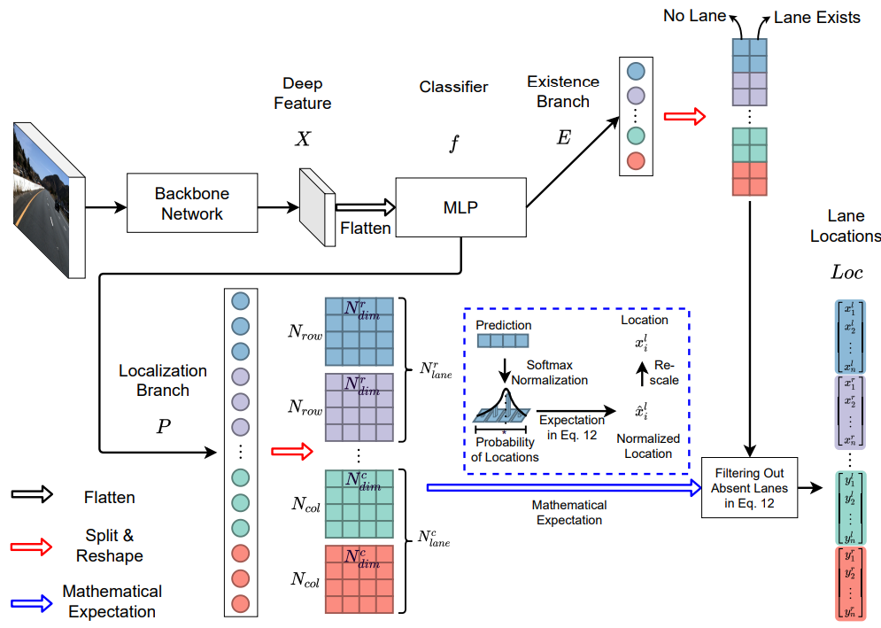

# Vietnamese_traffic_detection 
PyTorch implementation of the paper "[Ultra Fast Deep Lane Detection with Hybrid Anchor Driven Ordinal Classification](https://arxiv.org/abs/2206.07389)".




# Overview
This is the integration of UFDLv2 algorithm and YOLO algorithm to detect Vietnamese traffic with new redesigned features to run well on Windows (the original implementation was built on Linux). Moreover, a new evaluation method written in Python is also implemented.


# Get started
-Please modify the `demo_integrate.py` in any configs you would like to run. We will use `configs/culane_res34.py` as an example.
-For evaluation, please run the `evaluate.py` with your custom directory
```
# Trained models
We provide trained models on CULane, Tusimple, and CurveLanes.

| Dataset    | Backbone | F1   | Link |
|------------|----------|-------|------|
| CULane     | ResNet18 | 75.0  |  [Google](https://drive.google.com/file/d/1oEjJraFr-3lxhX_OXduAGFWalWa6Xh3W/view?usp=sharing)/[Baidu](https://pan.baidu.com/s/1Z3W4y3eA9xrXJ51-voK4WQ?pwd=pdzs)    |
| CULane     | ResNet34 | 76.0  |   [Google](https://drive.google.com/file/d/1AjnvAD3qmqt_dGPveZJsLZ1bOyWv62Yj/view?usp=sharing)/[Baidu](https://pan.baidu.com/s/1PHNpVHboQlmpjM5NXl9IxQ?pwd=jw8f)   |
| Tusimple   | ResNet18 | 96.11 |   [Google](https://drive.google.com/file/d/1Clnj9-dLz81S3wXiYtlkc4HVusCb978t/view?usp=sharing)/[Baidu](https://pan.baidu.com/s/1umHo0RZIAQ1l_FzL2aZomw?pwd=6xs1)   |
| Tusimple   | ResNet34 | 96.24 |   [Google](https://drive.google.com/file/d/1pkz8homK433z39uStGK3ZWkDXrnBAMmX/view?usp=sharing)/[Baidu](https://pan.baidu.com/s/1Eq7oxnDoE0vcQGzs1VsGZQ?pwd=b88p)   |
| CurveLanes | ResNet18 | 80.42 |   [Google](https://drive.google.com/file/d/1VfbUvorKKMG4tUePNbLYPp63axgd-8BX/view?usp=sharing)/[Baidu](https://pan.baidu.com/s/1jCqKqgSQdh6nwC5pYpYO1A?pwd=urhe)   |
| CurveLanes | ResNet34 | 81.34 |   [Google](https://drive.google.com/file/d/1O1kPSr85Icl2JbwV3RBlxWZYhLEHo8EN/view?usp=sharing)/[Baidu](https://pan.baidu.com/s/1fk2Wg-1QoHXTnTlasSM6uQ?pwd=4mn3)   |

